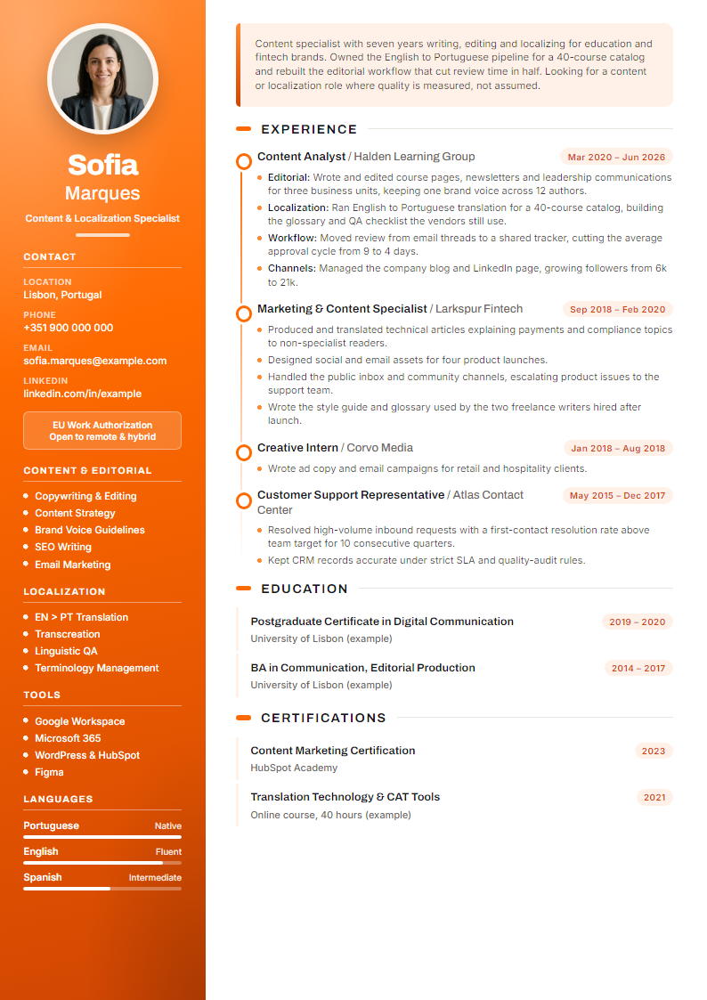
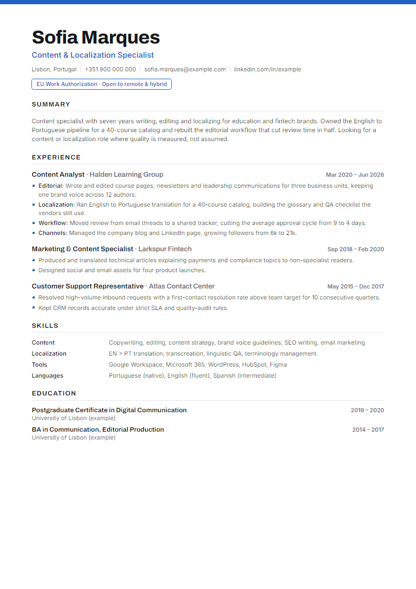
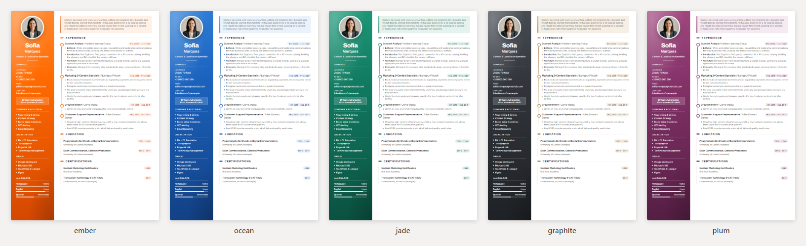
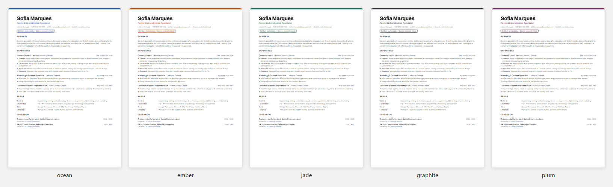

# fired.cv

**Demissão pela IA. Currículo pela IA.** Uma skill de currículo pra agente de IA: entrega seu currículo velho de Word e recebe uma página A4 que parece cara, que o robô da triagem lê limpo e que não inventa nada. Depois, uma dessas pra cada vaga.

> **É um agente de IA lendo isto?** Suas instruções estão no [SKILL.md](SKILL.md).

> A Sofia passou anos escrevendo, editando e traduzindo pra mesma empresa.
> Em 2026 o cargo dela foi cortado e o trabalho foi pro Claude.
> Então a gente pediu pro Claude devolver o favor e ajudar ela a conseguir o próximo emprego.
> Foi isso que saiu. É de graça. Ser substituída já custou o bastante.
>
> *Nome, foto e detalhes são fictícios. A história não.*

<p>
  
  
</p>

## Usar

**Cola o link** em qualquer agente que lê link (Claude, ChatGPT, Gemini, Codex, Cursor) e anexa o currículo velho:

```
Usa sapiensinteticos.com/fired-cv pra montar meu currículo.
```

**Claude Code**, instala uma vez:

```bash
git clone https://github.com/inhabitants/fired-cv ~/.claude/skills/fired-cv
```

(`~/.codex/skills/` no Codex, ou onde o seu agente guarda skills.)

**App do Claude**: baixa o [fired-cv.zip](fired-cv.zip) e adiciona em Configurações, na parte de Skills.

Depois é só dizer "monta meu currículo com esse arquivo" e soltar o `.docx`, o PDF ou o LinkedIn exportado. Junta a vaga, se tiver. O site com os exemplos é o [index.html](index.html).

## O que ela faz

- **Entrevista você, ou lê o que você colar.** Um bloco por vez, nunca um formulário de 40 campos.
- **Ajusta pra vaga** com as palavras da própria vaga, só onde elas são verdade. Nunca planta palavra-chave que você não sustenta na entrevista, e avisa quais estão faltando.
- **Escala pra um currículo por vaga.** Cola dez vagas, recebe dez currículos ajustados e uma planilha `applications.md`. Demitem em escala, você se candidata em escala. Do outro lado a triagem também é IA.
- **Cabe em uma página** e aperta numa ordem fixa em vez de encolher a fonte.
- **Lê como recrutador** antes de entregar: pra que vaga essa pessoa é óbvia, e qual a primeira dúvida.
- **Escreve a carta de apresentação** se você quiser.
- **Sua foto e seus dados ficam na sua máquina.** Sem upload, sem conversor online.

## Cinco temas de cor




`ember`, `ocean`, `jade`, `graphite` e `plum`, nos dois modelos. Troca o `data-theme` na tag `<html>`, ou deixa a pessoa escolher numa folha com os cinco lado a lado:

```bash
node scripts/build.mjs meu-curriculo.html --themes
```

## Os três bugs que ela confere

O Chrome transforma HTML num PDF bonito cuja camada de texto pode quebrar calada. O sistema de triagem lê a camada de texto, não a imagem. O `scripts/build.mjs` se recusa a entregar página com qualquer um destes:

1. **Espaçamento entre letras largo** separa a palavra: o robô lê `E X P E R I Ê N C I A`.
2. **`text-shadow`** faz o Chrome desenhar cada letra duas vezes: seu nome existe duas vezes no texto.
3. **`position: relative` misturado** embaralha o texto: o Chrome escreve na ordem de pintura, e um título pode ir parar longe da seção dele.

O terceiro a gente achou montando isto aqui. Nenhum dos três dá erro.

## Montar na mão

```bash
node scripts/build.mjs templates/sidebar.html --photo eu.jpg --theme jade
```

Node 18+ e Chrome, Edge ou Chromium. Zero dependência. Com Python e `pip install pymupdf`, ele também lê a camada de texto real do PDF e confere a ordem de leitura. Sem terminal, abre o HTML no Chrome e imprime em PDF (A4, margens nenhuma, gráficos de fundo ligados).

## Status

Publicado, não mantido. Funciona, é MIT, faz um fork e deixa com a sua cara. Sem roadmap, sem suporte, sem newsletter.

---

Da bancada do [Sapiens Sintéticos](https://sapiensinteticos.com). English: [README.md](README.md).
